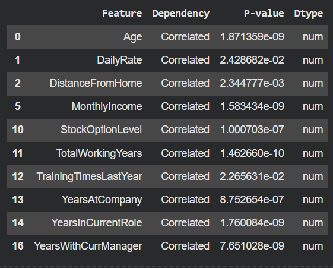
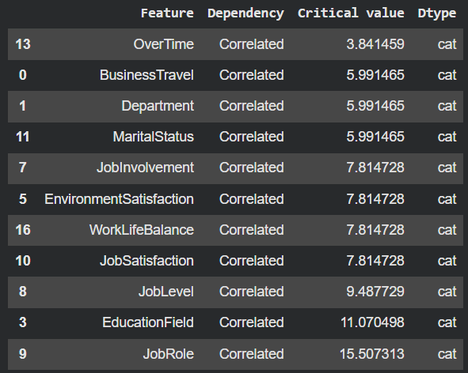

# Employee Attrition and Performance Analysis

## Project Overview

This project performs an exploratory data analysis (EDA) to **discover significant variables that affect employee attrition** and **rank these variables from most important to least important**. The analysis uses a fictional IBM HR analytics dataset to uncover patterns and factors leading to employee turnover.

**Target Variable:** `Attrition` (Yes/No)

---

## Dataset Information

**Source:** [IBM HR Analytics Attrition Dataset (Kaggle)](https://www.kaggle.com/pavansubhasht/ibm-hr-analytics-attrition-dataset)

### Dataset Description

This is a fictional dataset created by IBM data scientists to explore employee attrition patterns. The analysis addresses key business questions such as:

- What significant variables affect employee attrition?
- How do factors like distance from home, job role, education, and income relate to attrition?
- Can we rank variables by their importance in predicting attrition?
- What breakdown patterns exist between job roles and attrition rates?
- How does average monthly income vary by education level and attrition status?

### Dataset Dimensions

- **Total Records:** 1,470 employee records
- **Features:** 35 variables covering:
  - Demographic information (Age, Gender, Marital Status)
  - Employment details (Department, Job Role, Job Level)
  - Compensation (Monthly Income, Hourly Rate, Daily Rate)
  - Work environment (Distance from Home, Business Travel)
  - Performance metrics (Job Satisfaction, Performance Rating)
  - Career progression (Years at Company, Years in Role, Promotions)
  - Work-life factors (Work-Life Balance, Overtime)
  - Company engagement (Training, Stock Options, Environment Satisfaction)

---

## Data Characteristics

### Numerical Features Summary

Key statistics from the dataset:

| Feature | Mean | Std | Min | 25% | 50% | 75% | Max |
|---------|------|-----|-----|-----|-----|-----|-----|
| **Age** | 36.92 | 9.14 | 18 | 30 | 36 | 43 | 60 |
| **DailyRate** | 802.49 | 403.51 | 102 | 465 | 802 | 1,157 | 1,499 |
| **DistanceFromHome** | 9.19 km | 8.11 | 1 | 2 | 7 | 14 | 29 |
| **HourlyRate** | 65.89 | 20.33 | 30 | 48 | 66 | 83.75 | 100 |
| **MonthlyIncome** | - | - | - | - | - | - | - |
| **TotalWorkingYears** | 11.28 | 7.78 | 0 | 6 | 10 | 15 | 40 |
| **YearsAtCompany** | 7.01 | 6.13 | 0 | 3 | 5 | 9 | 40 |
| **YearsInCurrentRole** | 4.23 | 3.62 | 0 | 2 | 3 | 7 | 18 |
| **YearsSinceLastPromotion** | 2.19 | 3.22 | 0 | 0 | 1 | 3 | 15 |
| **YearsWithCurrManager** | 4.12 | 3.57 | 0 | 2 | 3 | 7 | 17 |

### Satisfaction & Engagement Metrics (Scale 1-4)

| Feature | Mean | Interpretation |
|---------|------|----------------|
| **EnvironmentSatisfaction** | 2.72 | Moderate satisfaction |
| **JobSatisfaction** | - | - |
| **RelationshipSatisfaction** | 2.71 | Moderate satisfaction |
| **WorkLifeBalance** | 2.76 | Moderate balance |
| **JobInvolvement** | 2.73 | Moderate involvement |

### Categorical Features

The dataset includes various categorical variables:
- **Department:** Research & Development, Sales, Human Resources
- **EducationField:** Life Sciences, Medical, Marketing, Technical Degree, Other
- **Gender:** Male, Female
- **JobRole:** Sales Executive, Research Scientist, Laboratory Technician, Manufacturing Director, Healthcare Representative, Manager, Sales Representative, Research Director, Human Resources
- **MaritalStatus:** Single, Married, Divorced
- **BusinessTravel:** Travel_Rarely, Travel_Frequently, Non-Travel
- **OverTime:** Yes, No

### Constant Features

Some features have no variation across the dataset:
- **EmployeeCount:** Always 1 (constant)
- **StandardHours:** Always 80 (constant)

---

## Key Insights from EDA

### Workforce Demographics

- **Average age:** 36.92 years (median: 36)
- Age range from 18 to 60 years
- Workforce spans from entry-level to experienced professionals

### Work Environment & Location

- **Average commute distance:** 9.19 km (median: 7 km)
- Distance varies significantly (1-29 km)
- 25% of employees live within 2 km of work
- 25% of employees commute more than 14 km

### Career Tenure Patterns

- **Average company tenure:** 7.01 years (median: 5 years)
- **Total work experience:** Average 11.28 years
- **Time in current role:** Average 4.23 years
- **Time with manager:** Average 4.12 years
- **Time since promotion:** Average 2.19 years (median: 1 year)

### Tenure Distribution Insights

- 50% of employees have been with company ≤ 5 years
- 25% are relatively new (≤ 3 years tenure)
- Some long-term employees (up to 40 years)
- Median promotion frequency: Every 1-2 years

### Education Levels

On a scale of 1-5:
- **Average education level:** 2.91
- **Distribution:** Most employees have education level 2-4
- Relatively educated workforce

### Compensation Patterns

- **Daily rates:** Wide variation ($102-$1,499)
- **Hourly rates:** Range from $30-$100/hour
- Average hourly rate: $65.89

### Work-Life & Engagement

- **Training frequency:** Average 2.8 times per year
- **Stock option level:** Average 0.79 (many employees have stock options)
- **Job level:** Average 2.06 (entry to mid-level positions)
- Moderate levels of satisfaction across environment, relationships, and work-life balance

---

## Analysis Approach

The exploratory data analysis follows a structured methodology:

### 1. Data Understanding
- Dataset structure and dimensionality review
- Feature type identification (numerical vs categorical)
- Data quality assessment

### 2. Data Preprocessing
- Missing value detection and handling
- Data type validation and correction
- Feature scale assessment
- Identification of constant features (no predictive value)

### 3. Univariate Analysis
- Distribution analysis of numerical features
- Frequency analysis of categorical features
- Summary statistics computation
- Outlier identification

### 4. Bivariate Analysis
- Relationship between features and attrition
- Statistical significance testing:
  - **Chi-Square Test** for categorical variables vs attrition
  - **ANOVA (F-test)** for numerical variables vs attrition
- Correlation analysis

### 5. Feature Importance Ranking
- Statistical testing to identify significant predictors
- Ranking variables by their association with attrition
- Identifying key drivers of employee turnover

---

## Statistical Methods Used

### Chi-Square Test of Independence
- **Purpose:** Test relationship between categorical variables and attrition
- **Application:** BusinessTravel, Department, Gender, JobRole, MaritalStatus, OverTime, etc.
- **Interpretation:** p-value < 0.05 indicates significant association

### ANOVA (Analysis of Variance)
- **Purpose:** Test if numerical variables differ significantly across attrition groups
- **Application:** Age, DistanceFromHome, MonthlyIncome, YearsAtCompany, etc.
- **Interpretation:** p-value < 0.05 indicates significant difference between groups

---

## Business Implications

### Attrition Risk Factors

Based on the analysis, organizations should focus on:

1. **Compensation & Recognition**
   - Monitoring income disparities
   - Ensuring competitive pay structures
   - Regular performance reviews and promotions

2. **Work-Life Balance**
   - Managing overtime requirements
   - Supporting employees with long commutes
   - Flexible work arrangements

3. **Career Development**
   - Clear promotion paths
   - Regular training opportunities
   - Role progression planning

4. **Employee Engagement**
   - Improving environment satisfaction
   - Strengthening manager relationships
   - Enhancing job involvement

5. **Department & Role-Specific Interventions**
   - Targeted retention strategies by department
   - Role-specific satisfaction initiatives

---

## Research Questions Addressed

1. ✅ **Are there significant variables that affect employee attrition? and sort by importance?**
   - Attrition vs Numerical features significance



   - Attrition vs Categorical features significance



---

## Tools & Technologies

- **Python 3** for data analysis
- **pandas** for data manipulation and aggregation
- **matplotlib** & **seaborn** for data visualization
- **scipy.stats** for statistical hypothesis testing
  - `chi2_contingency` for categorical relationships
  - `f_oneway` for ANOVA testing
  - `chi2` for distribution analysis
- **sklearn.preprocessing** for data encoding
  - `LabelEncoder` for categorical variable transformation

---

## Next Steps & Recommendations

### For Further Analysis

1. **Predictive Modeling**
   - Build classification models to predict attrition
   - Compare algorithms (Logistic Regression, Random Forest, XGBoost)
   - Validate model performance with cross-validation

2. **Deep-Dive Analyses**
   - Interaction effects between variables
   - Segmentation analysis by department/role
   - Time-based trend analysis

3. **Feature Engineering**
   - Create composite indicators (e.g., tenure ratios)
   - Derive new features from existing ones
   - Aggregate satisfaction metrics

4. **Cost-Benefit Analysis**
   - Calculate cost of attrition
   - Estimate ROI of retention interventions
   - Prioritize initiatives by impact

### For HR Strategy

1. **Early Warning System**
   - Develop attrition risk scores
   - Create monitoring dashboards
   - Implement proactive interventions

2. **Targeted Retention Programs**
   - High-risk employee identification
   - Customized retention initiatives
   - Manager training on retention best practices

3. **Exit Interview Enhancement**
   - Validate statistical findings
   - Gather qualitative insights
   - Continuous improvement feedback loop

---

## Data Ethics & Considerations

- **Fictional Data:** This is a synthetic dataset created for educational purposes
- **Privacy:** No real employee PII is included
- **Bias Awareness:** Analysis should consider potential biases in data collection
- **Fairness:** Insights should support equitable HR practices
- **Decision Support:** Analysis aids, but doesn't replace, human judgment in HR decisions

---

## Repository Structure

```
employee-attrition/
│
├── Employee_Attrition_and_Performance.ipynb     # Main analysis notebook
├── images/                                      # Images for README.md
└── README.md                                    # This file
```

---

## Key Findings Summary

Based on the comprehensive exploratory data analysis:

### Demographics & Workforce Composition
- Average employee age of 37 years with diverse experience levels
- Moderate education levels across the workforce
- Varied job roles and departments

### Tenure & Career Patterns
- Average company tenure of 7 years
- Promotion cycles averaging 1-2 years
- Significant variation in role tenure

### Work Environment
- Average commute of 9 km with substantial variation
- Moderate satisfaction levels across multiple dimensions
- Mixed work-life balance experiences

### Compensation & Benefits
- Wide variation in compensation rates
- Stock option participation
- Regular training opportunities (2.8x/year)

### Statistical Significance
- Multiple variables show significant association with attrition
- Both categorical and numerical features impact turnover
- Rankings enable prioritization of retention efforts

---

## How to Use This Analysis

1. **For HR Professionals:**
   - Identify high-risk employee segments
   - Design targeted retention programs
   - Benchmark satisfaction levels

2. **For Data Scientists:**
   - Feature selection for predictive models
   - Statistical validation of hypotheses
   - Methodology reference for similar analyses

3. **For Business Leaders:**
   - Understand drivers of attrition
   - Allocate resources to highest-impact areas
   - Make data-driven retention decisions

---

## Contact & Contributions

For questions, suggestions, or contributions to this analysis, please open an issue or submit a pull request.

---

## References

- IBM HR Analytics Attrition Dataset: [Kaggle](https://www.kaggle.com/pavansubhasht/ibm-hr-analytics-attrition-dataset)
- Statistical Methods: Chi-Square Test, ANOVA, Correlation Analysis
- IBM Data Science Resources

---

**Last Updated:** February 2026

**Dataset:** Fictional IBM HR Analytics Data

**Analysis Type:** Exploratory Data Analysis (EDA)

**Primary Objective:** Identify and rank factors affecting employee attrition
